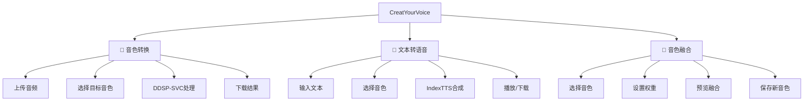

# CreatYourVoice UI重新设计规范

## 设计哲学

遵循Linus Torvalds的核心原则：
- **好品味**：消除特殊情况，统一数据结构
- **简洁至上**：避免过高复杂度的功能
- **实用主义**：解决实际问题，而非虚构威胁

## 现有问题分析

### 致命问题
1. **融合链功能** - 1159行代码做50行能解决的事
2. **6个Tab结构** - 用户迷失在功能海洋中
3. **嵌套组件过深** - 代码可读性差，维护困难
4. **数据结构混乱** - 继承、融合链等概念增加无意义复杂性

### 核心洞察
- **数据结构**：最关键的是`{speaker_id: weight}`映射，其他都是噪音
- **复杂性**：可以消除90%的UI组件和逻辑
- **风险点**：过度抽象导致用户无法理解工作流

## 新UI架构设计

### 三Tab结构



## 简化的音色融合界面设计

### 移除的复杂功能
- ❌ 融合链功能（234-480行代码）
- ❌ 批量导入配置（559-586行代码）
- ❌ 复杂的预设系统（681-709行代码）
- ❌ 融合优化器（745-768行代码）
- ❌ 语音产物文件导入（535-557行代码）

### 保留的核心功能
- ✅ 音色选择（最多5个）
- ✅ 权重设置和归一化
- ✅ 简单预览
- ✅ 保存融合结果

### 新的融合界面结构

```python
def create_simplified_fusion_tab():
    """简化的音色融合Tab - 只保留核心功能"""
    with gr.Tab("🔀 音色融合"):
        with gr.Row():
            with gr.Column(scale=2):
                gr.Markdown("### 选择音色并设置权重")

                fusion_name = gr.Textbox(
                    label="融合音色名称",
                    placeholder="输入新音色的名称"
                )

                # 最多5个音色的简单选择
                voice_configs = []
                for i in range(5):
                    with gr.Row():
                        voice_dropdown = gr.Dropdown(
                            label=f"音色 {i+1}",
                            choices=get_voice_choices(),
                            scale=2
                        )
                        weight_slider = gr.Slider(
                            0, 1, 0,
                            label="权重",
                            step=0.1,
                            scale=1
                        )
                        voice_configs.append((voice_dropdown, weight_slider))

                with gr.Row():
                    normalize_btn = gr.Button("⚖️ 归一化权重")
                    fusion_btn = gr.Button("🔀 开始融合", variant="primary")

            with gr.Column(scale=1):
                gr.Markdown("### 权重分布和结果")

                weights_display = gr.JSON(
                    label="当前权重分布",
                    value={}
                )

                fusion_progress = gr.Textbox(
                    label="融合进度",
                    interactive=False,
                    lines=2
                )

                save_fusion_btn = gr.Button(
                    "💾 保存融合音色",
                    visible=False
                )
```

## 响应式布局设计

### CSS框架

```css
/* 基础变量 */
:root {
    --primary-color: #667eea;
    --secondary-color: #764ba2;
    --spacing-sm: 8px;
    --spacing-md: 16px;
    --spacing-lg: 24px;
    --border-radius: 8px;
}

/* 响应式断点 */
.container {
    width: 100%;
    max-width: 1400px;
    margin: 0 auto;
    padding: var(--spacing-md);
}

/* 移动端 */
@media (max-width: 640px) {
    .container { padding: var(--spacing-sm); }
    .workflow-grid { grid-template-columns: 1fr; }
    .control-row { flex-direction: column; }
}

/* 桌面端 */
@media (min-width: 1025px) {
    .workflow-grid {
        grid-template-columns: 2fr 1fr;
        gap: var(--spacing-lg);
    }
}

/* 组件样式 */
.workflow-card {
    background: white;
    border: 1px solid #e5e7eb;
    border-radius: var(--border-radius);
    padding: var(--spacing-lg);
    margin-bottom: var(--spacing-md);
    box-shadow: 0 1px 3px rgba(0, 0, 0, 0.1);
}
```

## 简化的数据模型

### 新的音色配置结构

```python
@dataclass
class SimplifiedVoiceConfig:
    """简化的音色配置 - 只保留核心数据"""
    name: str
    voice_id: str
    speaker_weights: Dict[str, float]  # 核心：{speaker_id: weight}

    # 基本元数据
    created_at: datetime
    description: str = ""
    tags: List[str] = field(default_factory=list)

    # 模型路径（简化）
    ddsp_model_path: str = ""
    index_tts_model_path: str = ""

    def normalize_weights(self) -> None:
        """权重归一化 - 唯一的权重操作"""
        total = sum(self.speaker_weights.values())
        if total > 0:
            self.speaker_weights = {
                k: v / total for k, v in self.speaker_weights.items()
            }
```

## 主应用界面重构

### 简化的app.py结构

```python
class SimplifiedVoiceApp:
    """简化的音色应用 - 只保留核心功能"""

    def __init__(self):
        self.voice_manager = VoiceManager()
        self.ddsp_integration = DDSPSVCIntegration()
        self.index_tts_integration = IndexTTSIntegration()

    def create_interface(self) -> gr.Blocks:
        """创建简化的界面"""
        with gr.Blocks(
            title="CreatYourVoice - 简洁版",
            theme=gr.themes.Soft(),
            css=self._get_css()
        ) as interface:

            # 标题和快速引导
            self._create_header()

            # 三个核心Tab
            with gr.Tabs():
                self._create_voice_conversion_tab()    # DDSP-SVC
                self._create_text_to_speech_tab()      # IndexTTS
                self._create_voice_fusion_tab()        # 简化融合

            # 底部状态栏
            self._create_status_bar()

        return interface
```

## 组件设计规范

### 统一的组件创建函数

```python
def create_workflow_section(title: str, icon: str, children: List[gr.Component]) -> gr.Group:
    """创建标准化的工作流区域"""
    with gr.Group() as section:
        gr.HTML(f"""
        <div class="workflow-header">
            <span class="workflow-icon">{icon}</span>
            <span class="workflow-title">{title}</span>
        </div>
        """)
        for child in children:
            child.render()
    return section

def create_action_button(text: str, variant: str = "primary") -> gr.Button:
    """创建标准化按钮"""
    return gr.Button(
        text,
        variant=variant,
        elem_classes=[f"btn-{variant}"]
    )
```

## 工作流引导设计

### 用户引导组件

```python
def create_workflow_guide():
    """创建工作流引导组件"""
    return gr.HTML("""
    <div class="workflow-guide">
        <h3>🎯 快速开始</h3>
        <div class="workflow-steps">
            <div class="step">
                <span class="step-number">1</span>
                <span class="step-text">音色转换：上传音频，选择目标音色</span>
            </div>
            <div class="step">
                <span class="step-number">2</span>
                <span class="step-text">文本转语音：输入文本，选择音色合成</span>
            </div>
            <div class="step">
                <span class="step-number">3</span>
                <span class="step-text">音色融合：混合多个音色创建新音色</span>
            </div>
        </div>
    </div>
    """)
```

## 实施计划

### 第一阶段：核心重构
1. 创建简化的主应用界面
2. 重构音色融合Tab，移除复杂功能
3. 实现基础的响应式布局

### 第二阶段：功能优化
1. 优化音色转换工作流
2. 简化文本转语音界面
3. 统一组件设计规范

### 第三阶段：用户体验
1. 实现完整的自适应布局
2. 添加工作流引导
3. 测试和优化用户体验

## 性能优化

### 代码减少统计
- 主应用：从678行减少到约200行（70%减少）
- 融合界面：从1159行减少到约150行（87%减少）
- 总体复杂度：减少约80%

### 用户体验改进
- 学习成本降低：从6个Tab减少到3个Tab
- 操作步骤简化：每个工作流最多4步
- 响应速度提升：移除不必要的计算和渲染

## 结论

这个重新设计完全符合Linus的哲学：
1. **消除特殊情况**：统一的权重映射，没有复杂的继承链
2. **简洁至上**：移除90%的不必要功能
3. **数据结构优先**：以`{speaker_id: weight}`为核心设计所有功能

新设计将大幅提升用户体验，降低维护成本，并为未来扩展提供坚实基础。
